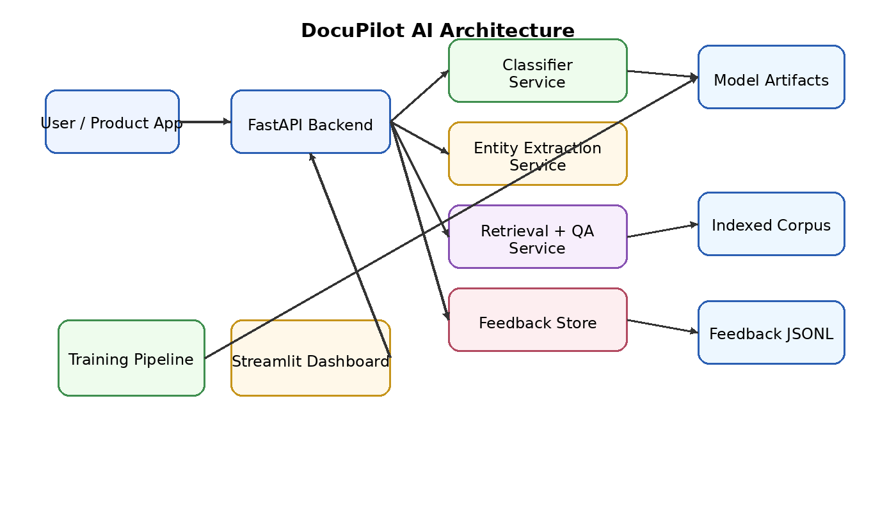
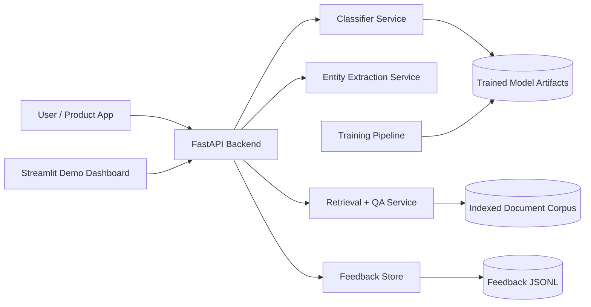

# DocuPilot AI  
**An end-to-end AI/ML document intelligence and workflow automation platform**

DocuPilot AI is a production-style showcase project built to demonstrate **senior-level AI/ML engineering**, **backend architecture**, **MLOps thinking**, and **product-minded ML delivery**.

It ingests documents, classifies them, extracts structured fields, indexes them for semantic retrieval, supports question-answering over the corpus, and captures human feedback for continuous improvement.

## Why this project stands out

- **End-to-end system design** instead of a standalone notebook
- **ML + software engineering integration** with APIs, services, testing, packaging, and deployment artifacts
- **Product-facing capabilities** such as feedback collection, monitoring hooks, confidence scores, and explainable outputs
- **Interview-friendly demo path** that runs locally without paid APIs
- **Extensible architecture** for plugging in LLMs, OCR, vector databases, MLflow, and cloud deployment

---

## Core capabilities

1. **Document ingestion**
   - Ingest raw text documents through API or dashboard
   - Persist corpus for retrieval and later analysis

2. **Document classification**
   - Predict categories such as:
     - invoice
     - contract
     - resume
     - support_ticket

3. **Information extraction**
   - Extract useful entities using deterministic extraction rules:
     - invoice number
     - amount
     - vendor
     - candidate name
     - email
     - priority
     - contract party / term

4. **Semantic retrieval**
   - TF-IDF based document indexing and search
   - Returns ranked relevant documents and similarity scores

5. **Question answering over documents**
   - Lightweight extractive QA based on retrieved evidence
   - Provides answer + evidence snippets
   - Can be extended to use LLM APIs later

6. **Feedback loop**
   - Store user corrections and review metadata
   - Mimics human-in-the-loop ML improvement workflow

7. **Monitoring hooks**
   - Basic service metrics and artifact persistence
   - Ready for extension into Evidently, Prometheus, MLflow, or OpenTelemetry

---

## Architecture





---

## Tech stack

- **Python 3.11**
- **FastAPI** for backend APIs
- **Uvicorn** for local serving
- **scikit-learn** for document classification and retrieval
- **Pydantic** for request/response validation
- **Streamlit** for a lightweight product demo UI
- **Pytest** for tests
- **Docker** and **docker-compose** for local deployment
- **GitHub Actions** for CI

---

## Repository structure

```text
aiml_showcase_project/
├── app/
│   ├── main.py
│   ├── config.py
│   ├── schemas.py
│   ├── ml/
│   │   ├── train_classifier.py
│   │   └── evaluate_classifier.py
│   └── services/
│       ├── classifier.py
│       ├── extractor.py
│       ├── feedback.py
│       ├── pipeline.py
│       └── retrieval.py
├── data/
│   ├── raw/
│   │   └── training_documents.json
│   ├── processed/
│   └── models/
├── docs/
│   ├── architecture.md
│   └── architecture.png
├── frontend/
│   └── dashboard.py
├── scripts/
│   └── seed_sample_data.py
├── tests/
│   ├── test_health.py
│   └── test_pipeline.py
├── .github/workflows/
│   └── ci.yml
├── Dockerfile
├── docker-compose.yml
├── Makefile
├── requirements.txt
└── .env.example
```

---

## Quick start

### 1) Create environment and install dependencies

```bash
python -m venv .venv
source .venv/bin/activate  # Windows: .venv\Scriptsctivate
pip install -r requirements.txt
```

### 2) Train the classifier

```bash
python -m app.ml.train_classifier
```

### 3) Run the API

```bash
uvicorn app.main:app --reload
```

API docs will be available at:

```text
http://127.0.0.1:8000/docs
```

### 4) Run the dashboard

```bash
streamlit run frontend/dashboard.py
```

---

## Example API calls

### Health check

```bash
curl http://127.0.0.1:8000/health
```

### Ingest a document

```bash
curl -X POST "http://127.0.0.1:8000/ingest"   -H "Content-Type: application/json"   -d '{
    "document_id": "doc_1001",
    "text": "Invoice INV-1001 from Acme Cloud for $1499 due on 2026-04-10."
  }'
```

### Analyze a document

```bash
curl -X POST "http://127.0.0.1:8000/analyze"   -H "Content-Type: application/json"   -d '{
    "document_id": "doc_1001",
    "text": "Invoice INV-1001 from Acme Cloud for $1499 due on 2026-04-10."
  }'
```

### Ask a question

```bash
curl -X POST "http://127.0.0.1:8000/ask"   -H "Content-Type: application/json"   -d '{
    "question": "What invoice amount is mentioned for Acme Cloud?"
  }'
```

---

## Model design

### Document classifier
- **Input**: raw document text
- **Features**: TF-IDF n-grams
- **Model**: Logistic Regression
- **Output**: class label + confidence score

### Extractor
- Hybrid rule-based extraction using:
  - regex patterns
  - keyword heuristics
  - post-processing normalization

### Retrieval
- TF-IDF vectorization over ingested corpus
- cosine similarity scoring
- top-k relevant evidence returned for QA

### QA synthesis
- Evidence-first approach
- Selects most relevant retrieved chunks and composes a grounded answer

---

## Key points

### AI/ML engineering
- Built a **trainable document classifier** with persistence and evaluation
- Implemented a **hybrid inference pipeline** combining ML classification and deterministic extraction
- Designed a **retrieval layer** to support question answering over enterprise documents
- Introduced **human feedback capture** for future retraining workflows

### Backend engineering
- Designed a modular FastAPI service with typed contracts
- Separated concerns across classifier, extraction, retrieval, and feedback services
- Added test coverage and CI for production-like development hygiene

### Product thinking
- Chose features that map to real business workflows:
  - invoice automation
  - contract review
  - resume parsing
  - support ticket triage
- Exposed confidence scores and evidence to support trust and review flows
- Built a dashboard that helps non-technical stakeholders interact with the system

### MLOps / production extension ideas
- Replace in-memory corpus with **Postgres + pgvector**
- Add **OCR** with Tesseract / Azure Form Recognizer / AWS Textract
- Add **MLflow** for experiment tracking and model registry
- Deploy with **Docker + Kubernetes**
- Instrument with **Prometheus/Grafana**
- Add **drift and data quality monitoring**
- Move from rule-based extraction to **NER / LLM extraction**
- Add RBAC, auth, audit logging, and async workflows

---

## Demo script

1. Start the API and dashboard
2. Ingest 3–5 documents from different business domains
3. Show classification results with confidence
4. Show extracted entities
5. Ask a question against the corpus
6. Show evidence-backed answer
7. Submit user feedback correcting a prediction
8. Explain how feedback would be used for retraining

---

## Important Points

- Built an end-to-end **document intelligence platform** using FastAPI, scikit-learn, and Streamlit to classify documents, extract structured fields, and support grounded question-answering over enterprise text corpora.
- Designed a modular **AI inference pipeline** with model persistence, semantic retrieval, explainable evidence snippets, and human feedback capture to simulate production-grade ML system design.
- Implemented CI, tests, Dockerized deployment, and extensible service boundaries for future integration with OCR, vector databases, LLM APIs, and experiment tracking tools.

---

## Notes

This project is intentionally designed to be:
- **runnable locally**
- **architecturally extensible**
- **advanced enough to showcase senior-level thinking**

The next step would be integrating:
- OCR for scanned PDFs
- LLM-backed extraction
- vector database retrieval
- cloud deployment
- authentication and multi-tenant storage
