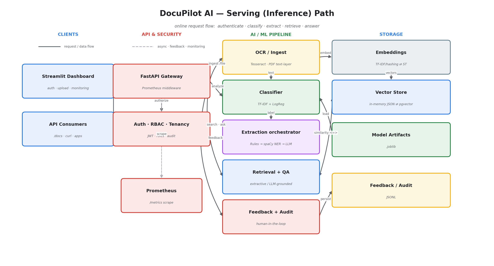
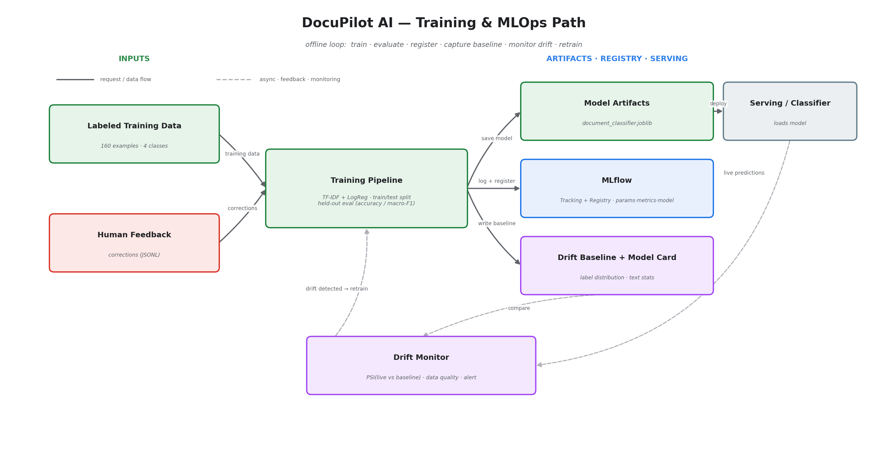

# DocuPilot AI
**An end-to-end AI/ML document intelligence and workflow automation platform**

DocuPilot AI ingests documents, classifies them, extracts structured fields,
indexes them for semantic retrieval, answers questions over the corpus, and
captures human feedback for continuous improvement — wrapped in a production-style
backend with auth, multi-tenancy, MLOps and observability.

> **Local-first by design.** Everything below runs with zero paid APIs and no
> external services. Each advanced backend (pgvector, OCR, NER/LLM, MLflow,
> Prometheus, Celery) is **opt-in via a config flag** and **degrades gracefully**
> to the local default when its dependency or credential is absent.

---

## What's new in v2.0

| Area | v1 | v2 |
|------|----|----|
| Retrieval | in-memory TF-IDF (JSON) | pluggable `VectorStore` → **Postgres + pgvector**, dense embeddings, **multi-tenant** |
| Extraction | regex rules | rules → **spaCy NER** → **LLM** orchestrator (hardened regex too) |
| Ingestion | text only | **+ file upload with OCR** (Tesseract / PDF text-layer) |
| Security | none | **JWT auth, RBAC** (viewer/analyst/admin), **audit log**, tenant scoping |
| MLOps | none | **MLflow** tracking/registry, held-out eval, **model card**, **drift monitoring** (PSI) |
| Observability | none | **Prometheus** metrics + **Grafana** dashboard, request/latency middleware |
| Async | sync | **BackgroundTasks → Celery** task runner |
| Deploy | Dockerfile | + **Compose profiles** & **Kubernetes** (Deployment/Service/Ingress/HPA) |
| Training data | 24 examples | **160 diverse examples** across the 4 classes |

---

## Core capabilities

1. **Document ingestion** — text or files (PDF/image/txt). Scanned PDFs and
   images are read via OCR (text-layer first, Tesseract fallback).
2. **Classification** — invoice / contract / resume / support_ticket with confidence.
3. **Information extraction** — hardened regex base, augmented by spaCy NER and/or
   an LLM depending on `EXTRACTION_BACKEND`.
4. **Semantic retrieval** — TF-IDF or dense embeddings; in-memory or pgvector;
   isolated per tenant.
5. **Question answering** — evidence-first extractive answers, or LLM-grounded
   answers when an LLM is configured.
6. **Feedback loop** — stores corrections (with actor/tenant) for retraining.
7. **MLOps & monitoring** — MLflow, Prometheus/Grafana, drift + data-quality.

---

## Architecture

DocuPilot separates the **online serving path** (handling requests) from the **offline training / MLOps path** (producing and monitoring the model).

### Serving (inference) path



### Training & MLOps path



See [`docs/architecture.md`](docs/architecture.md) for the full design and the
backend-selection matrix.

---

## Tech stack

Python 3.11 · FastAPI · scikit-learn · Pydantic · Streamlit · Pytest · Docker /
Compose / Kubernetes · GitHub Actions. Optional: psycopg + pgvector,
sentence-transformers, pytesseract, spaCy, OpenAI/Anthropic, MLflow,
prometheus-client, Celery/Redis.

---

## Quick start (local, no extra services)

```bash
python -m venv .venv && source .venv/bin/activate   # Windows: .venv\Scripts\activate
pip install -r requirements.txt
python -m app.ml.train_classifier      # trains + writes model card & drift baseline
python -m scripts.seed_sample_data     # optional: seed a few documents
uvicorn app.main:app --reload          # API docs at http://127.0.0.1:8000/docs
streamlit run frontend/dashboard.py    # demo UI
```

Run the tests:

```bash
pytest -q
```

---

## Advanced backends

Every advanced capability is an **optional, config-selected backend**. The
default config runs with zero external services; setting a flag swaps in a
production backend, and if its dependency/credential is missing the system
**degrades gracefully** to the local default (the API still starts and serves —
check `GET /config` to see which backend is actually live).

Backends are toggled via environment variables. The repo ships two ready-made
env files you can run with `--env-file`:

| File | What it turns on |
|------|------------------|
| `.env` | Tier 1 + NER: Prometheus, MLflow, spaCy NER (local-first, no Docker) |
| `.env.pgvector` | Full stack: pgvector + dense embeddings + NER + Prometheus + MLflow |

```bash
python -m uvicorn app.main:app --reload --env-file .env          # or .env.pgvector
```

Install the matching extras with `pip install -r requirements-optional.txt`, or
just the ones you need as shown below.

### Tier 1 — observability (no external services)

```bash
pip install prometheus-client mlflow
# .env: PROMETHEUS_ENABLED=true   MLFLOW_ENABLED=true
```

* **Prometheus** — real metrics at `GET /metrics/prometheus`
  (`docupilot_requests_total`, `docupilot_predictions_total`, latency
  histograms, `docupilot_corpus_documents`). Scraped by the Prometheus service
  in `docker-compose.yml` and visualised by the provisioned Grafana dashboard.
* **MLflow** — `POST /retrain` (or `python -m app.ml.train_classifier`) logs
  params, metrics and the model to a local `mlruns/` store. View with
  `python -m mlflow ui` → http://localhost:5000. Set `MLFLOW_TRACKING_URI` to a
  running MLflow server to also register the model in the model registry.

### Tier 2 — spaCy NER extraction

```bash
pip install spacy
python -m spacy download en_core_web_sm
# .env: EXTRACTION_BACKEND=ner
```

`POST /analyze` now augments the regex rules with statistical entities —
`organizations`, `people`, `dates`, `locations` — and reports
`"extraction_methods": ["rules","ner"]`.

### Tier 2 — dense semantic embeddings

```bash
pip install sentence-transformers
# .env: EMBEDDING_BACKEND=sentence-transformers
```

Search/Ask become semantic (MiniLM, 384-dim) instead of keyword-based, still
in-memory. Note: this pulls PyTorch (~2 GB) and downloads the model on first
run. For a fast, torch-free test use `EMBEDDING_BACKEND=hashing` (same 384 dims).

### Tier 3 — Postgres + pgvector retrieval

```bash
docker compose --profile db up -d postgres        # pgvector/pgvector image + init.sql
pip install "psycopg[binary]" pgvector sentence-transformers
python -m uvicorn app.main:app --reload --env-file .env.pgvector
```

Documents are stored and searched in Postgres (`documents` table, cosine
distance via the `<=>` operator), namespaced per tenant. `GET /config` should
report `"vector_backend":"pgvector"`; if it shows `memory`, Postgres isn't
reachable (graceful fallback). The table is `vector(384)` — if you switch to an
embedding model with a different dimension, set `EMBEDDING_DIM` and drop the
`documents` table so it recreates.

```bash
# inspect what's stored
docker exec -it docupilot-postgres psql -U docupilot -d docupilot \
  -c "select tenant_id, document_id from documents;"
```

### LLM-backed extraction / QA (paid API)

```bash
pip install openai            # or: anthropic
# .env: EXTRACTION_BACKEND=llm  LLM_PROVIDER=openai  OPENAI_API_KEY=sk-...
```

`/analyze` adds `"llm"` to `extraction_methods`; `/ask` returns
`"answer_backend":"llm"` with a grounded answer over retrieved evidence.

### Auth, RBAC & multi-tenancy

```bash
# .env: AUTH_ENABLED=true
```

Enables JWT auth (`POST /auth/token`), the role hierarchy
viewer < analyst < admin, per-tenant document isolation, and audit logging.
Demo users: `admin/admin123`, `analyst/analyst123`, `viewer/viewer123`.

### Backend selection matrix

| Concern | Default | Production backend | Flag |
|---------|---------|--------------------|------|
| Vector store | in-memory JSON | Postgres + pgvector | `VECTOR_BACKEND` |
| Embeddings | TF-IDF / hashing | sentence-transformers | `EMBEDDING_BACKEND` |
| Extraction | regex rules | spaCy NER / LLM | `EXTRACTION_BACKEND` |
| Auth | open | JWT + RBAC + tenants | `AUTH_ENABLED` |
| Experiment tracking | local model card | MLflow | `MLFLOW_ENABLED` |
| Metrics | no-op | Prometheus/Grafana | `PROMETHEUS_ENABLED` |
| Async | BackgroundTasks | Celery + Redis | `TASK_BACKEND` |

---

## API overview

| Method & path | Role | Purpose |
|---------------|------|---------|
| `GET /health`, `GET /config` | open | liveness + active config snapshot |
| `POST /auth/token`, `GET /auth/me` | open / any | login (OAuth2 password) + identity |
| `POST /analyze` | analyst | classify + extract + summarize |
| `POST /ingest`, `POST /ingest/file` | analyst | add text / upload file (OCR) |
| `POST /search`, `POST /ask` | viewer | semantic search / grounded QA |
| `POST /feedback` | analyst | store corrections |
| `GET /metrics`, `GET /monitoring/drift` | viewer | service + drift metrics |
| `GET /metrics/prometheus` | open | Prometheus scrape endpoint |
| `GET /audit` | admin | audit trail |
| `DELETE /documents/{id}` | admin | remove a document |
| `POST /retrain` | admin | async retrain + hot-reload |

When `AUTH_ENABLED=false` (default) all roles collapse to a built-in system
admin, so the demo works without logging in.

### Examples

```bash
curl http://127.0.0.1:8000/health

curl -X POST http://127.0.0.1:8000/analyze -H "Content-Type: application/json" \
  -d '{"document_id":"doc_1001","text":"Invoice INV-1001 from Acme Cloud for $1499 due on 2026-04-10."}'

# with auth enabled:
TOKEN=$(curl -s -X POST http://127.0.0.1:8000/auth/token \
  -d "username=analyst&password=analyst123" | python -c "import sys,json;print(json.load(sys.stdin)['access_token'])")
curl -X POST http://127.0.0.1:8000/ingest -H "Authorization: Bearer $TOKEN" \
  -H "Content-Type: application/json" -d '{"document_id":"d1","text":"Support ticket priority high."}'
```

---

## Deployment

```bash
docker compose up api                  # light: in-memory API only
docker compose --profile full up       # + Postgres/pgvector, MLflow, Prometheus, Grafana
kubectl apply -k deploy/k8s            # Deployment + Service + Ingress + HPA
```

Grafana ships with a provisioned Prometheus datasource and a DocuPilot
dashboard (`deploy/grafana`). Prometheus scrapes `/metrics/prometheus`.

---

## Repository structure

```text
app/
  main.py                 # FastAPI app: routes, RBAC, middleware, async hooks
  config.py               # env-driven settings + feature flags
  schemas.py              # Pydantic contracts
  ml/                     # train (MLflow + eval + baseline) / evaluate
  security/               # jwt, passwords, users/roles, auth+RBAC deps
  observability/          # prometheus metrics, drift/data-quality monitor
  services/
    classifier.py extractor.py extraction.py   # classify + extraction stack
    ner.py llm.py ocr.py                        # optional NER / LLM / OCR
    retrieval.py vectorstore/                   # facade + memory & pgvector backends
    embeddings.py feedback.py audit.py tasks.py # embeddings, feedback, audit, async
deploy/                   # k8s manifests, postgres init.sql, prometheus, grafana
frontend/dashboard.py     # Streamlit demo (auth, upload, monitoring)
tests/                    # pytest suite (fallback paths covered)
docker-compose.yml Dockerfile Makefile requirements*.txt
.env / .env.pgvector      # ready-made advanced-backend configs
```

---

## Demo script

1. Train, seed, start the API + dashboard.
2. Analyze documents from different domains — show label, confidence, entities,
   and which extraction methods fired.
3. Ingest a file (PDF/image) to show the OCR path.
4. Search and ask questions; show evidence-backed answers.
5. Submit feedback correcting a prediction.
6. Enable `AUTH_ENABLED=true`, log in as `viewer` vs `analyst`, show RBAC.
7. Open `/monitoring/drift` and `/metrics/prometheus`; explain retraining.

---

## Notes

This project is intentionally **runnable locally** and **architecturally
extensible**: the same code path serves the lightweight demo and the
production-backed deployment, switched entirely by configuration.
