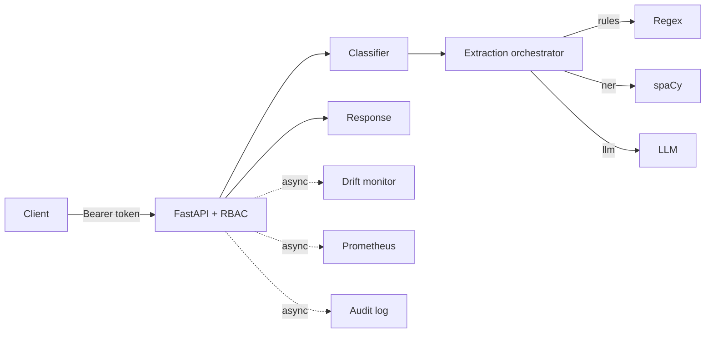

# Architecture Notes

DocuPilot AI is layered so that every advanced capability is an **optional,
pluggable backend** behind a stable interface. The default configuration runs
fully in-process with no external services; flipping a config flag swaps in a
production backend, and if that backend (or its dependency/credential) is
missing the system **degrades gracefully** to the local default.

## System layers

### 1. Product layer
- API consumers / internal tooling
- Streamlit demo app (login, file upload, monitoring views)

### 2. Application layer (FastAPI)
- Typed request/response schemas (Pydantic)
- Auth + RBAC dependencies (viewer < analyst < admin), per-tenant scoping
- Prometheus latency/request middleware
- Async side-effects via a task runner (BackgroundTasks → Celery)

### 3. AI/ML inference layer
- **Classifier** — TF-IDF + Logistic Regression, persisted artifact
- **Extraction orchestrator** — rules → spaCy NER → LLM (config driven)
- **Retrieval** — `RetrievalEngine` facade over a `VectorStore`
- **QA synthesis** — extractive by default, LLM-grounded when configured

### 4. Storage layer (pluggable)
- **VectorStore**: `InMemoryVectorStore` (TF-IDF/dense, JSON-persisted) or
  `PgVectorStore` (Postgres + pgvector, dense embeddings, multi-tenant rows)
- Model artifacts, feedback JSONL, audit JSONL

### 5. MLOps / observability layer
- **MLflow** experiment tracking + model registry (training hooks)
- **Prometheus** metrics + **Grafana** dashboards
- **Drift monitor**: PSI of live vs. training label distribution + data quality
- Model card (`metrics/model_card.json`) and drift baseline captured at train

## Backend selection (all fall back gracefully)

| Concern        | Default (local-first)        | Production backend            | Flag                  |
|----------------|------------------------------|-------------------------------|-----------------------|
| Vector store   | in-memory JSON               | Postgres + pgvector           | `VECTOR_BACKEND`      |
| Embeddings     | hashing / TF-IDF             | sentence-transformers         | `EMBEDDING_BACKEND`   |
| Extraction     | regex rules                  | spaCy NER / LLM               | `EXTRACTION_BACKEND`  |
| OCR            | text-layer / decode          | Tesseract + Poppler           | `OCR_ENABLED`         |
| Auth           | open (system admin)          | JWT + RBAC + tenants          | `AUTH_ENABLED`        |
| Experiment trk | local model card JSON        | MLflow                        | `MLFLOW_ENABLED`      |
| Metrics        | no-op                        | Prometheus/Grafana            | `PROMETHEUS_ENABLED`  |
| Async          | BackgroundTasks              | Celery + Redis                | `TASK_BACKEND`        |

## Request flow (POST /analyze)

## Deployment

- **Docker Compose** — `api` runs alone by default; `--profile full` adds
  Postgres/pgvector, MLflow, Prometheus and Grafana.
- **Kubernetes** — `deploy/k8s` (Deployment + Service + Ingress + HPA +
  ConfigMap/Secret), applied with `kubectl apply -k deploy/k8s`. Pod annotations
  expose `/metrics/prometheus` for scraping.
